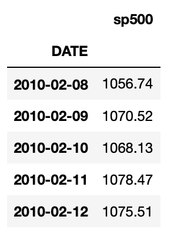
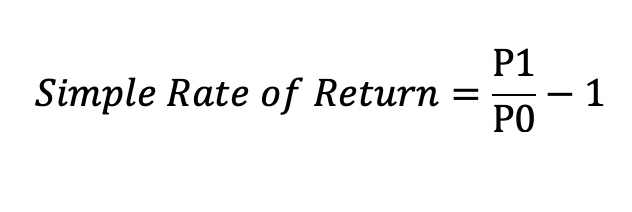

3 Steps:
-Retrieving market data
-Calculating returns
-Plotting


```python

import pandas as pd
#if you get an error after executing the code, try adding below:
pd.core.common.is_list_like = pd.api.types.is_list_like

import pandas_datareader.data as web
import datetime

start = datetime.datetime(2010, 1, 1)
end = datetime.datetime(2020, 1, 27)

SP500 = web.DataReader(['sp500'], 'fred', start, end)

print(SP500.head())
```
We get the outcome of...



```python
SP500['daily_return'] = (SP500['sp500']/ SP500['sp500'].shift(1)) -1

#Drop all Not a number values using drop method.
SP500.dropna(inplace = True)
```

