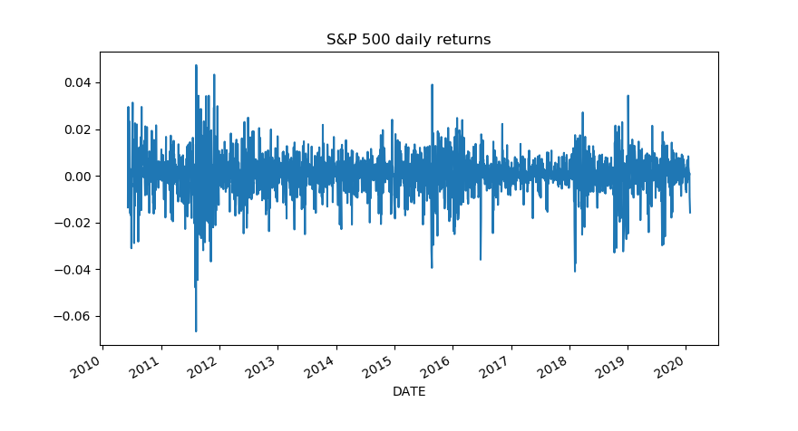

3 Steps:
-Retrieving market data
-Calculating returns
-Plotting


```python

import pandas as pd
#if you get an error after executing the code, try adding below:
pd.core.common.is_list_like = pd.api.types.is_list_like

import pandas_datareader.data as web
import datetime

start = datetime.datetime(2010, 1, 1)
end = datetime.datetime(2020, 1, 27)

SP500 = web.DataReader(['sp500'], 'fred', start, end)

print(SP500.head())
```
We get the outcome of...


Now to calculate the daily return


```python
SP500['daily_return'] = (SP500['sp500']/ SP500['sp500'].shift(1)) -1

#Drop all Not a number values using drop method.
SP500.dropna(inplace = True)
```
What shift method does is to shift our index by the number provided as an argument. In our case, we are shifting each of the values in the sp500 column by one. Meaning that we are diving the current day S&P 500 price by the previous day S&P 500 price.

NoW we plot

```python
SP500['daily_return'].plot(title='S&P 500 daily returns')
```


